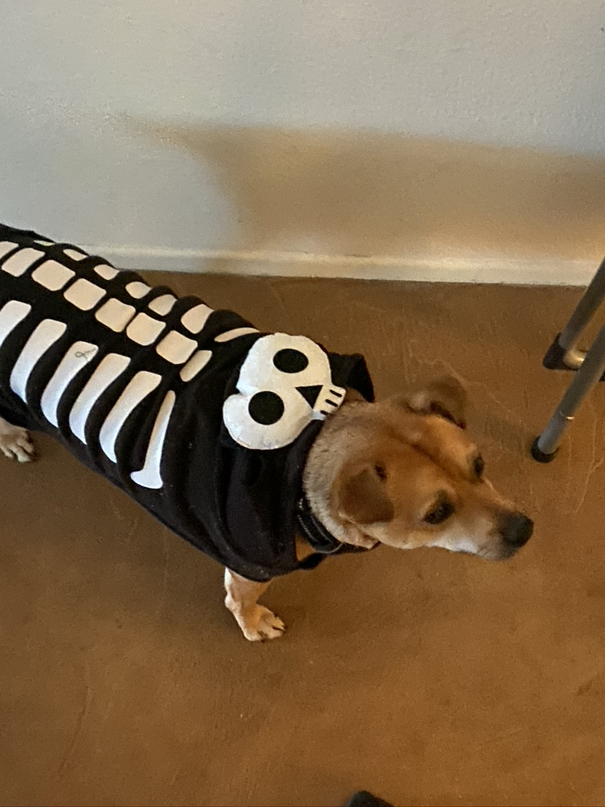
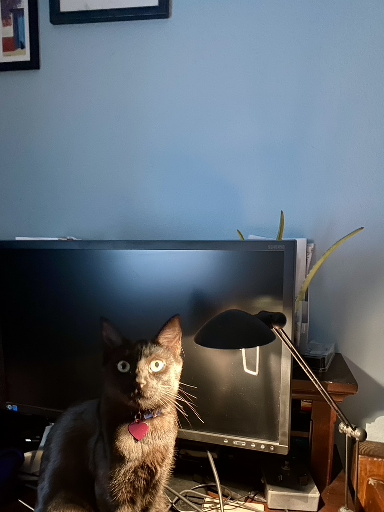
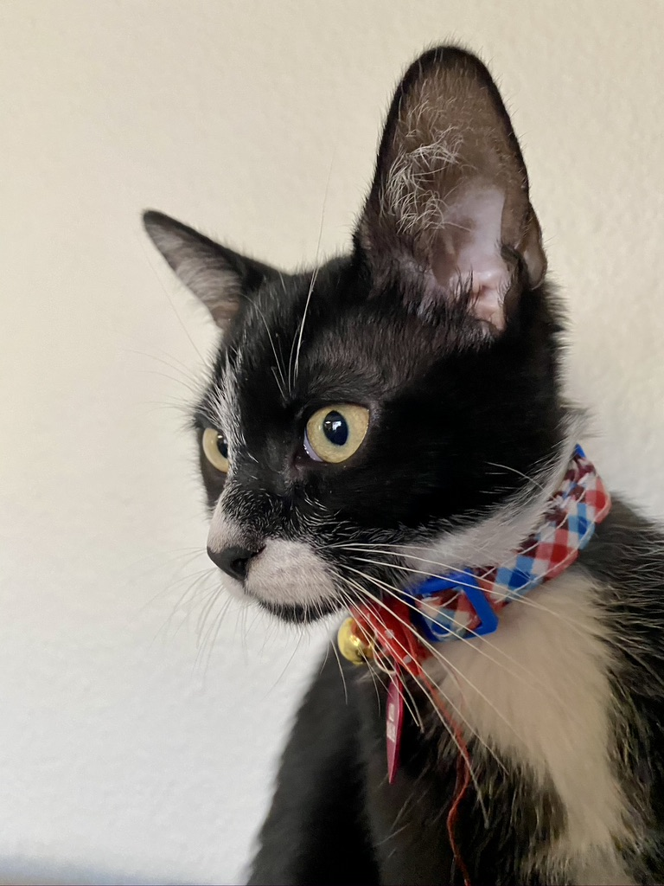

# About Me

Hi! My name is Diego. I'm a 🐈 🐈 🐕 and 🌱 parent. 

## Pets

  

     
  

  

    
  

  

    
  

  

    
Buddy

  

  

    
Frida

  

  

    
Archibald

  

## What I'm Reading

<table style="text-align:center; background-color: #ffffff;">
  <tr>
    <th>Reading</th>
    <th>Read (Last 30 books)</th> 
  </tr>
  <tr>
    <th>
      
      

        <!-- Show static html as a placeholder in case js is not enabled - javascript include will override this if things work -->
          

    

    

    

    

    

  <noscript> Share <a rel="nofollow" href="/">book reviews</a> and ratings with Diego, and even join a <a rel="nofollow" href="/group">book club</a> on Goodreads.</noscript>
  

      

      

    </th>
    <th>

        <!-- Show static html as a placeholder in case js is not enabled - javascript include will override this if things work -->

    

    

    

  <noscript> Share <a rel="nofollow" href="/">book reviews</a> and ratings with Diego, and even join a <a rel="nofollow" href="/group">book club</a> on Goodreads.</noscript>
  

      

    </th>
  </tr>
</table>

